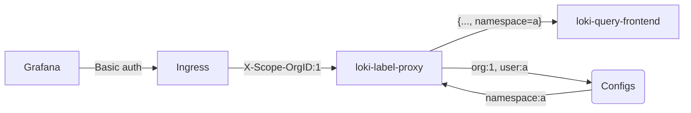

loki-label-proxy
================

`loki-label-proxy` can enforce given labels in a LogQL query coming from Grafana based on `X-Grafana-User` header. It is meant to be used in multi-tenant Grafana/Loki setup.

### How it works:

- Each Grafana Org have separate Loki datasource configured with a separate Basic Auth users. At query time Grafana sets 2 headers: `X-Grafana-Org-Id` and `X-Grafana-User`. 
- We cannot trust `X-Grafana-Org-Id` as it can be overridden by Grafana Org admin on datasource configuration page. So, to map Grafana Org to Loki tenant we use `X-Scope-OrgID` header which is set by Ingress based on auth-user.
- If `X-Scope-OrgID` header value is not found in configs, request is denied (400).
- We can trust `X-Grafana-User` as Org admin already has the widest permissions to its tenant logs
- Based on this header `loki-label-proxy` then rewrites the query to enforce given labels for this user from configuration file. 

### Configuration file:
```yaml
org: '1'    # X-Scope-OrgID header value
users:
  default:  # if user is not found in config, this section is used
    namespace: ingress-nginx # {...+, namespace="ingress-nginx"}

  user1@corp.domain:   # you can enforce multiple fields
    cluster: cluster1  # {...+, cluster="cluster1", index=~"app1|app2"}
    index: app1|app2

  admin: {}            # empty = does not enforce any additional labels
```
You can specify folder to read configuration files from. Each file should have users for single Org. Org id is unique and not merged, so last file read wins. Specified config path is monitored for changes and configs are reloaded automatically.

### Installation:
arm64/amd64 compiled images are available on docker hub: 
```sh
$ docker run sepa/loki-label-proxy
usage: loki-label-proxy [<flags>]

Proxy to enforce LogQL stream labels

Flags:
  -h, --help                 Show context-sensitive help (also try --help-long
                             and --help-man).
      --version              Show application version.
      --addr="http://localhost:3100"
                             Server address. Can also be set using LOKI_ADDR env
                             var.
      --username=""          Username for HTTP basic auth. Can also be set using
                             LOKI_USERNAME env var.
      --password=""          Password for HTTP basic auth. Can also be set using
                             LOKI_PASSWORD env var.
      --config=/configs ...  Path to config files/dirs (repeated).
      --log=info             Log filtering level (info, debug)
```